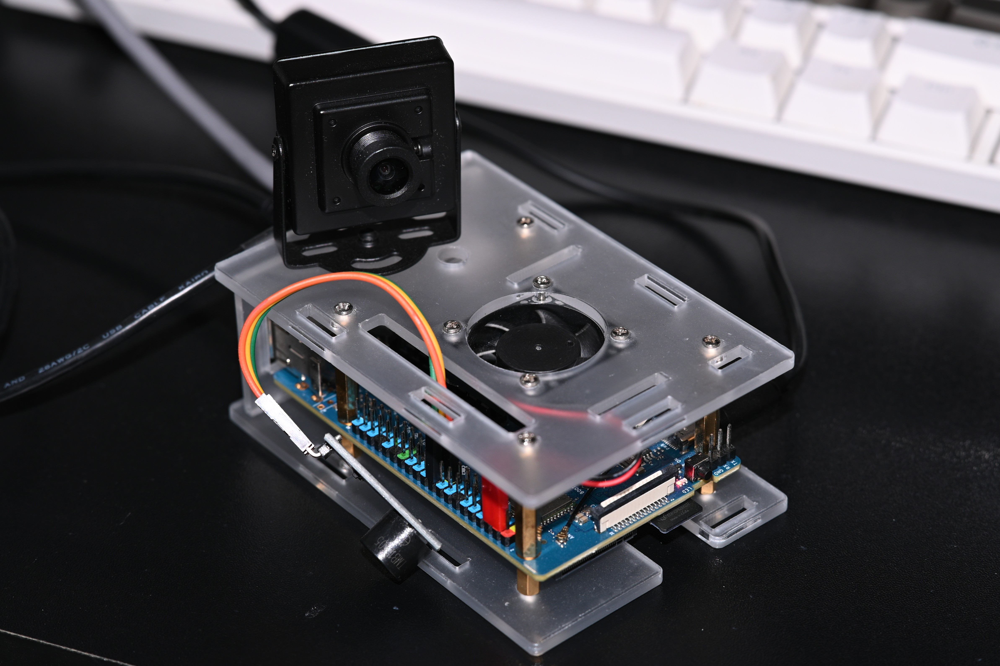
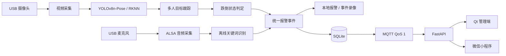

# 基于YOLOv8-Pose与语音关键字识别的多模态跌倒监测系统

> 基于 Orange Pi 3B 的多模态跌倒监测项目，融合 YOLOv8-Pose 视觉检测、离线语音关键词识别、边缘推理、可靠报警传输与云端管理。

## 项目简介

本项目面向居家与室内安全监护场景，设计并实现一套运行在 **Orange Pi 3B（RK3566）** 上的边缘智能跌倒监测系统。

系统在边缘设备本地完成视频采集、人体姿态估计、跌倒判定与语音关键词识别。视觉侧使用 **YOLOv8n-Pose + RKNN Runtime** 获取人体关键点，并结合人体倾角、运动速度和连续帧状态进行跌倒判断；语音侧通过 USB 麦克风运行离线 **Keyword Spotting（KWS）**，识别“救命”“救救我”等紧急求救关键词。

视觉检测与语音识别最终统一进入报警处理流程，并通过 **MQTT、SQLite、FastAPI、Qt** 等模块完成本地报警、断网缓存、网络恢复补传、云端存储和管理端展示。


---

## 系统架构



---

## 核心功能

### 1. 边缘视觉跌倒检测

- 使用 YOLOv8n-Pose 进行人体检测与关键点提取；
- 通过 RKNN Runtime 调用 RK3566 NPU 完成边缘推理；
- 根据躯干倾角、髋部垂直速度、身体中心速度和连续帧状态进行跌倒判断；
- 采用状态机避免单帧姿态误判；
- 支持多人场景，每个目标独立维护跌倒状态；
- 支持安全躺卧区域判断，用于降低床、沙发等场景中的误报警。

典型状态流转：

```text
NORMAL
  ↓
SUSPECTED_FALL
  ↓
CONFIRMED_FALL
  ↓
ALARMED
```

### 2. 离线语音求救识别

- 通过 ALSA 采集 USB 麦克风音频；
- 使用 sherpa-onnx 运行离线 Keyword Spotting；
- 支持“救命”“救救我”等求救关键词；
- 语音识别运行在独立线程中，不依赖云端语音服务；
- 原始音频不长期保存，仅输出关键词识别结果。

### 3. 多模态协同报警

视觉跌倒和语音求救统一转换为报警事件，并记录事件类型、来源、设备、部署区域、时间、人员轨迹及关键词等信息。

当视觉与语音在一定时间窗口内先后触发时，可将两种来源合并到同一个事件中，使管理端看到的是同一次异常的多源证据，而不是两条完全独立的报警。

### 4. 可靠报警与断网容灾

报警链路采用 **Local-First** 思路：

```text
报警产生
   ↓
SQLite PENDING
   ↓
MQTT QoS 1
   ↓
Broker PUBACK
   ↓
SQLite UPLOADED
```

主要设计包括：

- 报警先写入本地 SQLite，再尝试上传；
- MQTT 使用 QoS 1 传输关键报警；
- 网络恢复后由独立补传线程重新发送 `PENDING` 事件；
- 使用唯一 `event_id` 保证重复发送时的幂等性；
- MQTT 支持自动重连和订阅恢复。

### 5. 事件视频与实时监控

- 使用环形缓存保存近期视频帧；
- 视觉跌倒事件触发后异步生成现场短视频；
- 使用 FFmpeg + Rockchip RKMPP 进行 H.264 硬件编码；
- 视频编码任务与 AI 推理线程解耦，避免阻塞实时检测；
- 用户端支持按需开启实时视频，而不是持续上传原始视频。

---

## 多线程设计

边缘端采用 C++17 多线程架构，将实时任务与耗时 I/O 解耦。主要线程包括：

```text
Camera Capture
Audio / KWS
Alert Processing
Retry Upload
Heartbeat
SQLite Worker
Video Encoding
Live Streaming
```

线程之间主要使用 `std::thread`、`std::atomic`、`std::mutex`、`std::condition_variable`、线程安全队列和生产者/消费者模型进行同步与数据交换。

程序支持 `SIGINT / SIGTERM` 优雅退出，并对 MQTT、音频、摄像头及后台工作线程等资源进行统一释放。

---

## 技术栈

| 模块 | 技术 |
| --- | --- |
| 边缘硬件 | Orange Pi 3B / Rockchip RK3566 |
| 操作系统 | Ubuntu 22.04 ARM64 |
| 边缘开发 | C++17 / CMake |
| 姿态估计 | YOLOv8n-Pose |
| NPU 推理 | RKNN Runtime |
| 图像处理 | OpenCV |
| 目标跟踪 | IoU + 中心点距离 |
| 音频采集 | ALSA |
| 关键词识别 | sherpa-onnx KWS |
| 消息通信 | MQTT / Paho MQTT C++ |
| 本地存储 | SQLite3 / WAL |
| 视频处理 | FFmpeg / RKMPP |
| 云端服务 | FastAPI |
| 桌面管理端 | Qt |
| 用户端 | 微信小程序 |
| 日志 | spdlog |
| 数据格式 | JSON / nlohmann-json |

---

## 工程设计重点

### 边缘推理

视觉模型部署在 RK3566 NPU 上运行，将主要感知和判断过程放在本地完成，降低对持续云端计算和视频上传的依赖。

### 多人独立状态

系统不使用单一全局跌倒状态，而是通过轻量级目标跟踪维护 `track_id`，为每个人分别记录姿态历史和跌倒状态。

### 异步任务解耦

视频编码、数据库写盘、报警处理和网络补传均尽量放到后台线程执行，减少对实时视觉推理主流程的阻塞。

### 弱网可靠性

通过 SQLite Local-First、MQTT QoS 1、自动重连、断网补传以及 `event_id` 幂等机制，提高异常网络环境下报警数据的可靠性。

---

## 项目组成

```text
fall-detection-gateway/
├── apps/                 # 边缘端程序入口
├── include/              # C++ 头文件
├── src/                  # 视觉、语音、网络、存储等核心模块
├── configs/              # 系统配置
├── models/               # RKNN / KWS 模型资源
├── cloud_backend/        # FastAPI 后端
├── deploy/               # 部署相关文件
├── CMakeLists.txt
└── README.md
```

配套客户端包括 Qt Desktop Admin 与微信小程序。

---

## 构建与运行

### 环境要求

边缘端主要依赖：

```text
OpenCV
RKNN Runtime
Paho MQTT C/C++
SQLite3
ALSA
sherpa-onnx / ONNX Runtime
FFmpeg
RKMPP
spdlog
nlohmann-json
```

### 编译

```bash
mkdir -p build
cd build
cmake ..
cmake --build . -j$(nproc)
```

运行方式以项目当前 CMake 输出路径为准，例如：

```bash
./bin/fall_detection_gateway
```

系统参数通过配置文件管理，包括摄像头、模型路径、MQTT Broker、设备 ID、部署区域、报警阈值及存储路径等。

---

## 当前进度

目前已完成核心边缘监测链路，包括：

- YOLOv8-Pose RKNN 推理；
- 多人目标跟踪与跌倒状态判定；
- 离线中文 KWS；
- 视觉与语音统一报警处理；
- MQTT 报警上报与自动重连；
- SQLite 本地持久化与断网自动补传；
- 事件视频缓存与硬件编码；
- FastAPI 基础服务；
- Qt 设备与报警管理；
- 小程序报警记录与按需视频功能；
- 边缘程序优雅退出与基础服务化部署。

当前主要工作集中在安全区域可视化配置、微信主动消息通知、视频异常补传以及系统性能与检测效果测试。

---

## 后续测试

项目后续将重点评估：

- 跌倒检测 Precision、Recall、F1-score；
- 正常行为误报情况；
- 单帧推理耗时与实际 FPS；
- 报警端到端响应时间；
- CPU、内存与存储占用；
- MQTT 断网恢复时间；
- 报警补传成功率；
- 不同姿态、距离及场景下的检测稳定性。

---

## 项目亮点

本项目不仅关注模型推理本身，更侧重于 **Linux 环境下完整实时系统的设计与实现**。项目覆盖了：

- ARM Linux 边缘 AI 部署；
- C++ 多线程与生产者/消费者模型；
- USB 摄像头与 ALSA 音频采集；
- NPU 推理与硬件视频编码；
- MQTT 网络通信与弱网容灾；
- SQLite 本地可靠存储；
- GDB 多线程故障定位；
- Systemd 服务化运行；
- FastAPI、Qt 与小程序多端协同。

---

